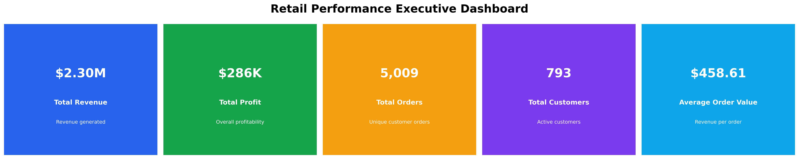

# 📊 Retail Sales Intelligence Analysis

## End-to-End Data Analytics Case Study using Python

---

## 📌 Project Overview

This project analyzes retail transaction data to uncover business insights related to sales performance, profitability, customer behavior, product performance, regional trends, and operational efficiency.

The goal is to transform raw retail data into actionable business recommendations using data analytics techniques.

---

## 🎯 Business Objectives

The analysis focuses on answering key business questions:

- How is revenue changing over time?
- Which products generate the highest revenue and profit?
- Which products negatively impact profitability?
- Which customer segments provide maximum value?
- How do discounts influence profit?
- Which regions and states perform best?
- How efficient is the shipping process?

---

# 📂 Dataset Information

Dataset Used:

**Superstore Sales Dataset**

Dataset Summary:

| Attribute | Value |
|---|---|
| Transactions | 9,994 |
| Features | 21 |
| Domain | Retail / E-Commerce |
| Data Type | Transactional Sales Data |

---

# 🛠 Tools & Technologies

- Python
- Pandas
- NumPy
- Matplotlib
- Seaborn
- Jupyter Notebook
- Data Cleaning
- Exploratory Data Analysis
- Data Visualization
- Business Intelligence

---

# 📊 Analysis Workflow


Raw Dataset

⬇

Data Cleaning

⬇

Feature Engineering

⬇

Exploratory Data Analysis

⬇

Visualization

⬇

Business Insights

⬇

Recommendations


---

# 📈 Executive KPI Dashboard

Key metrics analyzed:

- 💰 Total Revenue
- 📈 Total Profit
- 🛒 Total Orders
- 👥 Total Customers
- 💳 Average Order Value





---

# 🔍 Exploratory Data Analysis

## 1. Sales Performance Analysis

Analyzed:

- Yearly sales trends
- Monthly revenue performance
- Sales growth patterns

Key Objective:

Understand business revenue movement over time.

---

## 2. Profitability Analysis

Analyzed:

- Profit by category
- Profit by sub-category
- Discount impact on profitability

Key Finding:

High revenue does not always guarantee high profit.

---

## 3. Customer Analysis

Analyzed:

- Revenue by customer segment
- Profit contribution
- Top customers
- Sales vs profit relationship

Business Goal:

Identify valuable customer groups.

---

## 4. Product Performance Analysis

Analyzed:

- Best-selling products
- High-profit products
- Loss-making products

Business Goal:

Optimize product strategy.

---

## 5. Regional Performance Analysis

Analyzed:

- Revenue by region
- Profit by region
- Top-performing states

Business Goal:

Improve geographical decision-making.

---

## 6. Shipping Performance Analysis

Analyzed:

- Average shipping duration
- Customer segment delivery performance

Business Goal:

Improve operational efficiency.

---

# 📌 Key Business Insights

✔ Technology products contribute strongly to revenue.

✔ Some high-sales products generate lower profitability.

✔ Excessive discounting negatively affects profit margins.

✔ Customer segments show different purchasing behavior.

✔ Regional performance varies significantly.

✔ Shipping consistency impacts customer experience.

---

# 💡 Business Recommendations

## 1. Optimize Discount Strategy

Avoid excessive discounts on low-margin products.

---

## 2. Improve Product Portfolio

Promote profitable products and review loss-making items.

---

## 3. Strengthen Customer Retention

Focus on high-value customer segments.

---

## 4. Improve Regional Strategy

Apply successful strategies from profitable regions to weaker markets.

---

## 5. Monitor Operational Efficiency

Continue improving shipping performance.

---

# 📁 Project Structure

```
Retail-Sales-Intelligence-Analysis/

│
├── Dataset/
│   └── superstore_cleaned.csv
│
├── Notebooks/
│   └── exploratory_data_analysis.ipynb
│
├── Images/
│   └── visualization outputs
│
├── README.md
│
└── requirements.txt
```

---

# 🚀 How to Run Project

Clone repository:

```bash
git clone <repository-url>
```

Install dependencies:

```bash
pip install -r requirements.txt
```

Run:

```bash
jupyter notebook
```

---

# 🧠 Skills Demonstrated

- Data Cleaning
- Data Transformation
- Feature Engineering
- Exploratory Data Analysis
- Data Visualization
- Business Problem Solving
- Analytical Thinking
- Storytelling with Data

---

# 📌 Final Conclusion

This project demonstrates how retail businesses can use data analytics to identify growth opportunities, improve profitability, optimize operations, and make data-driven decisions.
